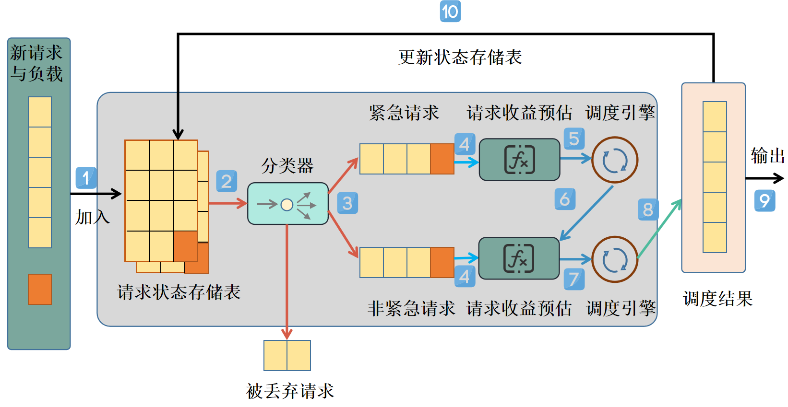
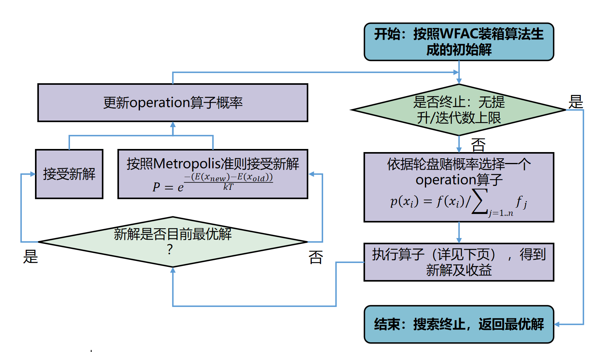

# SSScheduler

Smart Storage Scheduler for 2022 Massive Storage Competition.

## Run SSScheduler

```
python3 runner.py
```


## Structure



## Alns



- BPR算子：随机选择一个driver，选择其中一个request（根据它的requests的size来设置概率，size越大的被选择概率越大），将该request移除，从等待队列里面重新选择request放入该driver中。

- shift算子：随机选择一个driver，根据上述概率选择一个request移到另一个driver上面去，如果目标driver的capacity超出，则先选择一部分他的request移到其它driver上面去，如果依然超出，则移除部分requests，知道capacity不超出为止，最后从等待队列里面重新选择request放入这两个driver中。

- 退火算法计算接收概率：
  

- 一定要防止提交的driver的capacity被超出！为此我修改了runner.py，当出现capacity超出的情况会直接报错停止运行。
